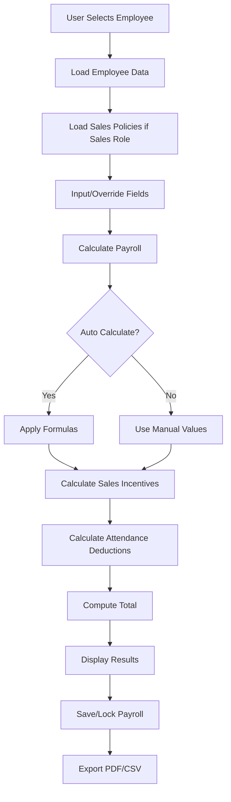

# Payroll System Overhaul Technical Specification

## Overview
This document outlines the technical specifications for overhauling the PayrollCalculator component and backend services to match the Excel payroll format, incorporating manual edit options for all fields, and ensuring integrated sales policy calculations for sales employees.

## Current System Analysis

### Existing Components
- **Frontend**: `PayrollCalculator.jsx` - React component for payroll calculation and management
- **Backend Models**: `Payroll.js`, `SalesPolicy.js`
- **Backend Services**: `payrollService.js` - Handles calculations
- **Backend Controllers**: `payrollController.js` - API endpoints

### Current Fields
- Basic Salary, HRA, PF, Gratuity, Allowances, Incentives, Performance Rewards, Deductions
- Attendance: Present Days, Late Arrivals, Early Departures
- Sales-specific: CV, Number of Sales

### Missing Fields (from Excel)
- Conveyance Allowance
- LTA (Leave Travel Allowance)
- Medical Allowance
- Professional Tax
- TDS (Tax Deducted at Source)

## Proposed Architecture

### System Flow Diagram



### Updated Data Model

#### Payroll Schema Updates
```javascript
{
  employee: { type: mongoose.Schema.Types.ObjectId, ref: 'Employee', required: true },
  month: { type: Number, required: true, min: 1, max: 12 },
  year: { type: Number, required: true },
  basicSalary: { type: Number, required: true },
  hra: { type: Number, default: 0 },
  conveyance: { type: Number, default: 0 }, // New
  lta: { type: Number, default: 0 }, // New
  medical: { type: Number, default: 0 }, // New
  pf: { type: Number, default: 0 },
  gratuity: { type: Number, default: 0 },
  professionalTax: { type: Number, default: 0 }, // New
  tds: { type: Number, default: 0 }, // New
  allowances: { type: Number, default: 0 }, // May be split into specific allowances
  incentives: { type: Number, default: 0 },
  performanceRewards: { type: Number, default: 0 },
  deductions: { type: Number, default: 0 },
  presentDays: { type: Number, default: 0 },
  lateArrivals: { type: Number, default: 0 },
  earlyDepartures: { type: Number, default: 0 },
  total: { type: Number, default: 0 },
  isLocked: { type: Boolean, default: false },
  auditTrail: [{ type: mongoose.Schema.Types.ObjectId, ref: 'Audit' }]
}
```

### Calculation Logic

#### Auto-Calculations
- **HRA**: 50% of Basic (Metro), 40% (Non-Metro)
- **PF**: 12% of Basic
- **Gratuity**: (Basic × 15 × Years of Service) / 26
- **Conveyance**: Fixed amount (₹19,200/year) or percentage
- **LTA**: 1 month's basic or fixed amount
- **Medical**: Fixed amount (₹50,000/year) or percentage
- **Professional Tax**: State-dependent calculation
- **TDS**: Based on tax slabs (requires income details)

#### Manual Override Fields
All fields should have manual edit capability with toggle switches.

#### Sales Employee Calculations
- Separate logic for sales roles using SalesPolicy
- Incentives based on number of sales, deal values, NPL/Normal classification
- Performance rewards based on policy salary reward percentage
- Integration with Deal model for actual sales data

### Frontend Component Structure

#### PayrollCalculator.jsx Updates
- Add input fields for new allowances (Conveyance, LTA, Medical)
- Add deduction fields (Professional Tax, TDS)
- Implement edit mode toggles for all calculable fields
- Maintain sales-specific section
- Update calculation display to show all components

#### UI Layout
```
Employee Selection | Month/Year | City Type

Salary Components:
- Basic Salary (always manual)
- HRA (auto/manual toggle)
- Conveyance (auto/manual toggle)
- LTA (auto/manual toggle)
- Medical (auto/manual toggle)
- Other Allowances

Deductions:
- PF (auto/manual toggle)
- Gratuity (auto/manual toggle)
- Professional Tax (auto/manual toggle)
- TDS (auto/manual toggle)
- Manual Deductions

Attendance:
- Present Days, Late, Early

Sales Section (conditional):
- Number of Sales, CV
- Incentives (auto/manual)
- Performance Rewards (auto/manual)

Calculate Button | Auto-calculate toggle

Results Display:
Grid showing all earnings and deductions with totals
```

### Backend Service Updates

#### payrollService.js Enhancements
- Add calculation functions for new fields
- Update `calculatePayroll` to include new fields
- Maintain separate sales incentive logic
- Integrate with Attendance model for accurate deductions

#### New Calculation Functions
```javascript
function calculateConveyance() { /* Fixed or percentage */ }
function calculateLTA(basicSalary) { /* 1 month basic */ }
function calculateMedical() { /* Fixed amount */ }
function calculateProfessionalTax(state, salary) { /* State-dependent */ }
function calculateTDS(annualIncome, deductions) { /* Tax calculation */ }
```

### API Endpoints

#### Existing Endpoints (to be updated)
- `POST /api/payroll` - Create payroll with new fields
- `GET /api/payroll` - Get payrolls
- `PUT /api/payroll/:id` - Update payroll
- `GET /api/payroll/:id/export` - PDF export (update format)

#### New/Updated Response Format
```json
{
  "employee": "...",
  "month": 1,
  "year": 2024,
  "basicSalary": 50000,
  "hra": 25000,
  "conveyance": 19200,
  "lta": 50000,
  "medical": 50000,
  "pf": 6000,
  "gratuity": 2884,
  "professionalTax": 235,
  "tds": 2500,
  "allowances": 10000,
  "incentives": 15000,
  "performanceRewards": 5000,
  "deductions": 2000,
  "total": 125799
}
```

### Export Formats

#### PDF Salary Slip Updates
- Include all new allowance fields in earnings section
- Add Professional Tax and TDS to deductions
- Update totals calculation
- Maintain professional formatting

#### CSV Export Updates
- Add columns for new fields
- Ensure Excel compatibility
- Include headers matching Excel format

### Sales Policy Integration

#### Separate Calculations for Sales Employees
- Detect sales role from Employee.position
- Apply SalesPolicy based on role (Sales Executive vs Manager)
- Calculate incentives based on:
  - Number of sales within min/max range
  - Deal values and types (NPL/Normal)
  - Supportive split percentages
- Add salary-based performance rewards

#### Policy Application Logic
```javascript
if (employee.position.includes('Sales')) {
  const policy = await SalesPolicy.findOne({ role: role });
  if (policy && salesCount >= policy.minSales) {
    incentives = calculateBasedOnPolicy(deals, policy);
    performanceRewards = basicSalary * (policy.salaryRewardPercentage / 100);
  }
}
```

### Security and Validation

#### Input Validation
- Numeric validation for all monetary fields
- Range validation for month/year
- Employee existence validation
- Permission checks for payroll creation/updates

#### Audit Trail
- Track all manual overrides
- Log calculation changes
- Maintain history for locked payrolls

### Testing Strategy

#### Unit Tests
- Test calculation functions individually
- Mock employee and policy data
- Test edge cases (zero values, max values)

#### Integration Tests
- Test full payroll calculation flow
- Test sales policy application
- Test export functionality

#### Manual Testing
- UI interaction for manual overrides
- PDF/CSV export verification
- Sales employee calculations

### Deployment Considerations

#### Database Migration
- Add new fields to existing Payroll collection
- Set default values for existing records
- Update indexes if needed

#### Backward Compatibility
- Ensure existing payrolls display correctly
- Maintain API response structure where possible
- Update frontend to handle missing fields gracefully

### Performance Optimizations

#### Calculation Caching
- Cache policy lookups
- Cache attendance calculations
- Implement Redis for frequently accessed data

#### Bulk Operations
- Support bulk payroll generation
- Optimize database queries with proper indexing

### Future Enhancements

#### Advanced Features
- Tax calculation engine integration
- Multi-currency support
- Payroll approval workflows
- Integration with accounting software

#### Reporting
- Advanced analytics dashboard
- Trend analysis
- Comparative reports

## Implementation Timeline

1. **Phase 1**: Update data models and backend services
2. **Phase 2**: Update frontend component
3. **Phase 3**: Update export functionality
4. **Phase 4**: Testing and validation
5. **Phase 5**: Deployment and monitoring

## Conclusion

This overhaul will bring the payroll system in line with standard Excel formats while maintaining flexibility for manual overrides and specialized sales calculations. The modular design allows for easy maintenance and future enhancements.